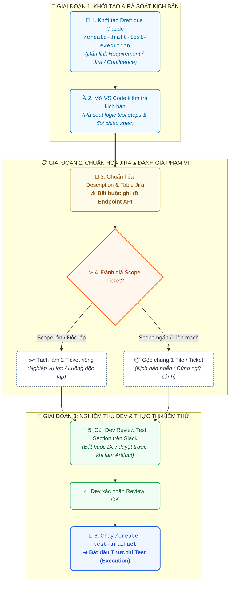

# 📝 Ghi chú ngày 14/09/2026 (Thứ Hai)

---

## 🎯 Mục tiêu trong ngày
- [x] **[API-QA] - [QA-6916]:** Enhance slack notification on Jenkins when having re-run
- [x] **Quy chuẩn Notification Transfer Instruction:** Phân loại cơ chế bắn thông báo Email và Slack theo trạng thái lệnh (Status)
- [ ] **[TEST EXECUTION] - [QA-6893] [GTO-14851]:** Transfer-coordinator Kafka migration - Slack + email notification regression
---

## 📝 Ghi chú công việc / Study

### 🧪 1. [API-QA] - [QA-6916]: Enhance Slack Notification on Jenkins When Having Re-run
> [!NOTE]
> * **Loại công việc:** Code Enhancement / Fix trên Jenkins (chỉnh sửa code logic, không viết test scenario) ➔ Áp dụng quy trình chuẩn cho Code Task.
> * **Mục đích chính:** Chỉnh sửa code xử lý, đọc và tổng hợp chính xác khi có **nhiều file kết quả (multi-file results)** trong các lượt re-run trên Jenkins, đảm bảo thông báo bắn về Slack phản ánh đúng toàn bộ kết quả test.

1. **Create New Branch:** Tạo branch độc lập `QA-6916-enhance-slack-notification-rerun` và chuyển status ticket sang `Testing`.
2. **Modify / Enhance Code:** Chỉnh sửa code logic đọc, gom và tổng hợp chính xác dữ liệu từ **nhiều file kết quả (multi-file results)** khi Jenkins kích hoạt re-run.
3. **Review Code:** Tự rà soát và review lại các đoạn code xử lý parsing / aggregation dữ liệu.
4. **Run Code / Test via Command:** Chạy test script qua command line (CLI/Terminal) với dữ liệu multi-file results để kiểm tra logic tổng hợp và thông báo gửi về kênh Slack.
5. **Fix Code:** Khắc phục các lỗi phát sinh về payload, format message hoặc sót kết quả từ các file (nếu có).
6. **Commit and Push Code:** Commit đúng chuẩn convention và push code lên remote branch.
7. **Create PR Summary:** Soạn thảo bản tóm tắt nội dung thay đổi của PR.
8. **Create Pull Request:** Tạo Pull Request trên GitHub vào repository tương ứng.
9. **Update Review Status:** Cập nhật trạng thái ticket Jira sang **`Under Review`**.
10. **Request Review (Dastan):** Đưa cho **Dastan** review PR và theo dõi phản hồi.

---

### 📢 2. Quy chuẩn Phân loại Notification theo Status (Transfer Instruction)

> [!IMPORTANT]
> **Quy tắc phân loại:** 
> * **📧 Email Notification:** Chỉ gửi cho các mốc nghiệp vụ trọng yếu cần hành động hoặc ảnh hưởng dòng tiền (`Approval Required`, `Approved`, `Failed`).
> * **💬 Slack Notification:** Gửi thông báo toàn diện cho **TẤT CẢ** các trạng thái trong vòng đời của Instruction (`All Statuses`).
> *(Nguồn: **Thai Huynh, Aug 13, 4:52 PM, Edited**)*

#### 📊 Bảng đối chiếu cơ chế thông báo (Email vs Slack Notification Matrix)

| STT | Trạng thái Instruction (Status) | 📧 Email Notification | 💬 Slack Notification | Ý nghĩa & Hành động kích hoạt |
| :---: | :--- | :---: | :---: | :--- |
| 1 | **Pending / Approval Required** | ✅ **GỬI** | ✅ **GỬI** | Lệnh vừa tạo, yêu cầu Checker vào kiểm tra và duyệt |
| 2 | **Initiated (Init)** | ❌ Không gửi | ✅ **GỬI** | Lệnh đã duyệt xong, bắt đầu thực thi các bước chuyển tiền |
| 3 | **Approved** | ✅ **GỬI** | ✅ **GỬI** | Lệnh đã được Checker phê duyệt thành công |
| 4 | **Success** | ❌ Không gửi | ✅ **GỬI** | Toàn bộ các bước chuyển tiền hoàn tất thành công 100% |
| 5 | **Failed (Failed Instruction)** | ✅ **GỬI** | ✅ **GỬI** | Lệnh bị lỗi ở ít nhất 1 step (cần cảnh báo khẩn) |
| 6 | **Abort** | ❌ Không gửi | ✅ **GỬI** | Lệnh đang chạy bị chủ động ngắt / dừng lại |
| 7 | **Reject** | ❌ Không gửi | ✅ **GỬI** | Lệnh bị Checker từ chối phê duyệt |

---

#### 📋 Chi tiết các kênh thông báo:

* **📧 1. Email Notification (3 trạng thái chọn lọc):**
  - 🟡 `Approval Required (pending)`: Gửi email tới Checker/Ops yêu cầu phê duyệt lệnh.
  - 🟢 `Approved`: Gửi email xác nhận lệnh đã được duyệt thành công.
  - 🔴 `Failed Instruction`: Gửi email cảnh báo khẩn cấp khi lệnh gặp sự cố/thất bại.

* **💬 2. Slack Notification ➔ ALL (Tất cả 7 trạng thái):**
  - 🟡 `pending`: Thông báo có lệnh mới chờ duyệt.
  - 🔵 `Init`: Thông báo lệnh đã khởi tạo và bắt đầu chạy các steps.
  - 🟣 `approved`: Thông báo lệnh đã có người approve.
  - 🟢 `success`: Thông báo lệnh đã hoàn tất giao dịch thành công.
  - 🔴 `failed`: Cảnh báo lỗi chi tiết step và mã lỗi.
  - 🟠 `abort`: Thông báo lệnh đã bị dừng khẩn cấp (aborted).
  - ⚫ `reject`: Thông báo lệnh đã bị từ chối phê duyệt (rejected).

---

## 💡 Ghi nhớ / Ideas

### 📋 Quy trình Tạo Draft Test Case (Rã Test Case) & Nghiệm thu Test Artifact (Test Execution Workflow)

> [!NOTE]
> **Khái niệm:** **Tạo Draft Test Case** chính là quá trình **rã kịch bản kiểm thử (deconstruct test cases)** dành cho các ticket **Test Execution**. Kịch bản được phân tích từ Requirement / Spec, sau đó rà soát kỹ lưỡng trước khi đưa vào Jira và tạo Test Artifact.

#### 🔄 Sơ đồ Quy trình 6 bước thực hiện chuẩn:

<p align="center">
  
</p>

<details>
<summary><b>🔍 Nhấn vào đây để xem / sao chép mã nguồn Mermaid của sơ đồ</b></summary>



</details>

#### 📋 Chi tiết các bước thực hiện:

1. **Khởi tạo Draft Test Case qua AI (Claude):**
   - Lấy link tài liệu yêu cầu nghiệp vụ (**Requirement / Confluence spec / Jira ticket**).
   - Dán link vào Claude và thực thi slash command:
     ```bash
     /create-draft-test-execution
     ```

2. **Kiểm tra & Rà soát trên VS Code:**
   - Mở file kịch bản vừa sinh trong **Visual Studio Code (VS Code)**.
   - Đọc kỹ, kiểm tra tính logic và tự review lại toàn bộ nội dung test steps.

3. **Chuẩn hóa bảng mô tả để dán vào Jira:**
   - Sử dụng prompt sau để AI đối chiếu với format ticket QA mẫu và sinh cấu trúc Description & Table tương ứng:
     ```text
     Please check with the existing ticket QA I sent you before and create the table and description that matches its format please.
     ```
   - > [!IMPORTANT]
     > **Lưu ý bắt buộc về Endpoint:** Khi mô tả API call, **bắt buộc phải ghi rõ Endpoint** (`URL`, `Method`, `Payload`) — cần xác định chính xác đang gọi vào endpoint nào và cơ chế thực thi ra sao.

4. **Xác định cấu trúc Ticket (Tách hay Gộp):**
   - **Tách làm 2 ticket riêng:** Nếu các nghiệp vụ riêng lẻ, phạm vi lớn hoặc luồng xử lý độc lập.
   - **Gộp chung 1 file/ticket:** Nếu kịch bản ngắn, liền mạch và cùng ngữ cảnh tính năng.

5. **Gửi Dev Review trước khi làm Test Artifact:**
   - Sau khi cập nhật Test Section lên Jira, **bắt buộc đưa cho Dev review và chốt trước**.
   - > [!WARNING]
     > **Không tự ý làm Test Artifact khi Dev chưa review và đồng thuận với Test Section.**
   - Gửi tin nhắn trao đổi trên Slack:
     > 💬 *"Hi @mohit, I have added the test section here: `<link ticket jira>`. Please help reviewing. Thank you!"*

6. **Tạo Test Artifact & Tiến hành thực thi:**
   - Khi Dev đã review và xác nhận **OK** ➔ Chạy tiếp slash command:
     ```bash
     /create-test-artifact
     ```
   - Sau khi hoàn tất Test Artifact, bắt đầu tiến hành thực thi kiểm thử (**Execute Tests**).

---
*Tạo tự động vào lúc 08:02:29 - Cập nhật format vào lúc 12:06:00*
