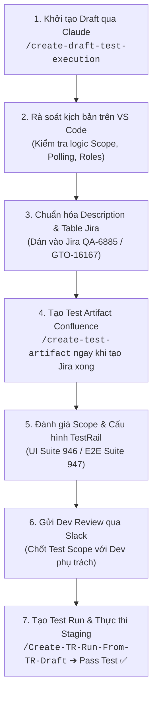

# 🌟 Ghi chú ngày 17/09/2026 (Thứ Năm)

## 🎯 Mục tiêu trong ngày
- [ ] **[TEST EXECUTION] - [QA-6885] [GTO-16167] [GTO-16282]:** Alert on Transfer Tool when instruction are pending approval

---

## 📝 Ghi chú công việc / Study

### 📋 1. [TEST EXECUTION] - [QA-6885] [GTO-16167] [GTO-16282]: Alert on Transfer Tool when instruction are pending approval

#### 🎯 A. Scope & Mục tiêu kiểm thử (Feature Overview & Scope)
- **Mục tiêu tính năng:** Hiển thị Badge (Huy hiệu số cảnh báo màu đỏ) ngay cạnh nhãn **Transfer Tool** trên thanh điều hướng chính (**Global Navigation Bar**) ở tất cả các trang trong hệ thống (Trading, Live Risk, Blotter, Transfer Tool...) khi có lệnh chuyển tiền ở trạng thái `PENDING_APPROVAL` đang chờ chính user đăng nhập duyệt.
- **Quy tắc hiển thị Badge (Visual & Count Rules):**
  - **Vị trí:** Nằm inline ngay bên phải nhãn `Transfer Tool` trên Global Nav.
  - **Quy tắc đếm:**
    - Đếm chính xác từ `1` đến `9`.
    - Từ 10 lệnh trở lên: Hiển thị dạng **`9+`**.
    - Khi count = 0 hoặc User không có quyền duyệt: **Ẩn hoàn toàn** (không render DOM, tuyệt đối không hiện dấu chấm đỏ trơn / bare dot, không giật layout).
  - **Kích thước cố định:** Kích thước container 18px (min-width/fixed-width) để nav không bị co giãn, giật layout khi số chuyển từ 1 sang 9+.
  - **Tính phản hồi tức thì (Optimistic UI):** Khi user click `Approve` hoặc `Reject` trên trang chi tiết lệnh, badge phải giảm hoặc biến mất ngay lập tức, không được đợi hết chu kỳ poll 60s.
- **Cơ chế Polling & Phân quyền (Polling Gate & Roles):**
  - Endpoint: `GET /ui/instruction/approvals/count`.
  - Chu kỳ polling: Tự động gọi mỗi **60 giây** (± jitter) đối với user có quyền duyệt (`TRANSFER_TOOL_APPROVE_INSTRUCTION`).
  - Gating:
    - User không có Transfer Tool trong strategy: **0 network call**.
    - User có Transfer Tool nhưng không có quyền duyệt: Gọi **1 lần** lúc khởi tạo, BE trả về `eligible: false` ➔ FE **dừng hẳn** chu kỳ polling.
    - User bị thu hồi quyền giữa chừng: Call tiếp theo nhận `eligible: false` ➔ Clear interval và dừng polling ngay lập tức.
  - Xử lý lỗi (Silent Error Handling): Khi API gặp lỗi mạng/500/503, giữ nguyên trạng thái hoặc ẩn nhẹ nhàng, **không hiển thị popup/toast lỗi** làm phiền người dùng.

---

#### 👥 B. Bảng dữ liệu kiểm thử (Test Data & Fixtures)

##### 1. Danh sách User Fixtures:
| User Fixture | Vai trò & Quyền hạn | Mục đích kiểm thử |
| :--- | :--- | :--- |
| **User A** | Initiator (Người tạo lệnh) | Tạo lệnh chuyển tiền thuộc Grant G1, nằm trong Approval Group |
| **User B** | Approver (Người duyệt lệnh) | Approver của Grant G1 (khác với User A) |
| **User C** | Viewer (Không có quyền duyệt) | Có quyền vào Transfer Tool nhưng KHÔNG có quyền duyệt ở bất kỳ grant nào |
| **User D** | Second Approver (Người duyệt thứ 2) | Cùng nhóm duyệt Grant G1 với User B (dùng cho lệnh yêu cầu multi-approver) |
| **User E** | Restricted User | User thuộc Strategy hoàn toàn không có quyền truy cập Transfer Tool |

##### 2. Danh sách Lệnh (Instruction Fixtures):
| Mã Lệnh | Trạng thái (`status`) | Grant & Người tạo | Kết quả mong đợi đối với User B |
| :--- | :--- | :--- | :--- |
| **`I1`** | `PENDING_APPROVAL` | Grant G1 do **User A** tạo | User B **thấy đếm tăng 1** |
| **`I2`** | `PENDING_APPROVAL` | Grant G1 do chính **User B** tạo (*Self-initiated*) | User B **KHÔNG thấy badge** (không tự duyệt lệnh của mình) |
| **`I3`** | `PENDING_APPROVAL` | Grant G1 do **User A** tạo, **User B đã approve**, đang chờ User D | User B **KHÔNG thấy badge** (đã duyệt xong), User D **thấy badge** |
| **`I4`** | `PENDING_APPROVAL` | Grant G2 do **User A** tạo (User B không thuộc nhóm duyệt Grant G2) | User B **KHÔNG thấy badge** |
| **`I5`** | Non-pending (`SETTLED` / `REJECTED` / `CANCELLED` / `EXPIRED`) | Grant G1 | Không tính vào badge |
| **`I6`** | `PENDING_APPROVAL` | Grant G1 bị vô hiệu hóa (*deactivated*) hoặc gỡ quyền approver giữa chừng | Badge tự động giảm/mất sau chu kỳ poll tiếp theo |
| **`I7`** | `PENDING_APPROVAL` | Grant không có approver nào được cấu hình | Không tính vào badge, không gây lỗi hệ thống |

---

#### 🧪 C. Bảng kịch bản Test Cases (Detailed Test Scenarios)

| Case ID | Tên Kịch bản (Test Scenario) | Điều kiện & Dữ liệu kiểm thử | Các bước thực hiện (Test Steps) | Kết quả mong đợi (Expected Results) |
| :--- | :--- | :--- | :--- | :--- |
| **TC-01** | Badge renders on nav item from any page | User B có lệnh `I1` pending approval | 1. Đăng nhập User B.<br>2. Điều hướng qua các trang ngoài Transfer Tool (Trading, Live Risk, Blotter). | Badge màu đỏ hiển thị inline bên phải nhãn "Transfer Tool" trên Global Nav ở mọi trang ngay từ initial paint, đúng chuẩn design token. |
| **TC-02** | Count accuracy & 9+ cap | Tạo số lượng lệnh pending approval tăng dần: 1, 5, 9, 10, 25 | 1. Kiểm tra badge khi có 1 lệnh.<br>2. Tăng dần lên 5, 9, 10, 25 lệnh. | - Từ 1 - 9: Hiển thị đúng số `1`, `5`, `9`.<br>- Từ 10 trở lên: Hiển thị đúng text **`9+`**.<br>- Kích thước badge cố định 18px, thanh nav không bị co giãn/giật vị trí. |
| **TC-03** | Nothing renders at zero count | User B không có lệnh pending approval nào | 1. Đăng nhập User B khi count = 0.<br>2. Kiểm tra thanh Nav và DOM. | Không hiển thị badge; không có DOM element ẩn chiếm chỗ; không xuất hiện chấm đỏ trơn (no bare red dot). |
| **TC-04** | Count equals what the user can actually approve | Hệ thống có lệnh `I1` (do A tạo, chờ B duyệt) | 1. Kiểm tra lần lượt với User B, C, D, E. | - User B: Thấy badge count = 1.<br>- User C, D, E: Không thấy badge (count = 0). |
| **TC-05** | Scoping: No badge for self-initiated / already-acted | Có lệnh `I2` (B tự tạo), `I3` (B đã duyệt), `I4` (grant khác) | 1. Đăng nhập User B.<br>2. Kiểm tra số lượng đếm trên badge. | Badge của User B = 0. Badge chỉ tính lệnh do người khác tạo mà User B có quyền duyệt và chưa thực hiện duyệt. |
| **TC-06** | Badge appears live without reload (~60s poll) | User B đang ở trang bất kỳ (count = 0) | 1. Giữ nguyên trang User B (không F5/reload).<br>2. User A tạo lệnh `I1`.<br>3. Chờ tối đa 60 giây. | Badge trên Nav của User B tự động xuất hiện với số `1` trong vòng 60 giây mà không cần tải lại trang. |
| **TC-07** | Polling gate: Call interval & user gating | Theo dõi tab Network (`GET /ui/instruction/approvals/count`) | 1. Đăng nhập lần lượt User B, User C, User E.<br>2. Quan sát request trong Network tab. | - **User B:** Gọi đều đặn mỗi 60s (± jitter).<br>- **User C:** Gọi 1 lần đầu nhận `eligible: false`, sau đó dừng hẳn.<br>- **User E:** Hoàn toàn không phát sinh request nào (0 calls). |
| **TC-08** | Polling stops when eligibility is lost | User B đang nhận poll bình thường | 1. Thu hồi quyền approver của User B trên hệ thống phân quyền.<br>2. Quan sát poll tiếp theo. | Endpoint trả về `eligible: false`, FE hủy interval ngay lập tức, không tiếp tục bắn request định kỳ. |
| **TC-09** | Badge clears immediately on Approve or Reject | User B đang có badge = 1 với lệnh `I1` | 1. User B vào chi tiết lệnh `I1`.<br>2. Nhấn nút **Approve** hoặc **Reject**. | Badge lập tức biến mất hoặc giảm số lượng ngay sau khi bấm nút (Optimistic/Event-driven), không cần chờ hết chu kỳ poll 60s. |
| **TC-10** | Silent error handling (No flapping/banners) | Chặn mạng hoặc mock API count trả về HTTP 500/503/Timeout | 1. Giả lập API count trả về lỗi 500.<br>2. Quan sát giao diện người dùng. | Không hiển thị toast/banner lỗi popup; badge giữ nguyên giá trị trước đó hoặc ẩn nhẹ nhàng; chu kỳ tiếp theo thành công tự khôi phục bình thường. |
| **TC-11** | Responsive / Narrow viewport (Dropdown nav) | Thu nhỏ màn hình trình duyệt về dạng tablet/mobile | 1. Resize viewport để Global Nav thu vào icon hamburger / menu "Applications".<br>2. Mở menu dropdown. | Mục "Transfer Tool" bên trong menu dropdown vẫn hiển thị đầy đủ badge màu đỏ với số đếm chính xác. |
| **TC-12** | Accessibility & Screen Reader (a11y) | Kiểm tra độ tương phản và thuộc tính ARIA | 1. Đo contrast ratio màu chữ trắng trên nền đỏ.<br>2. Dùng Screen Reader (hoặc inspect accessibility tree). | - Tỉ lệ tương phản màu ≥ 4.5:1.<br>- Có thuộc tính `aria-label="Transfer Tool, X instructions pending approval"`.<br>- Ẩn khỏi screen reader khi count = 0. |
| **TC-13** | Deep link / Navigation coherence | User B bấm vào nav item có badge | 1. User B click trực tiếp vào nút "Transfer Tool" có badge trên Nav. | Điều hướng vào đúng tab mặc định của Transfer Tool (tab Pending Approvals hoặc danh sách lệnh); số lượng hiển thị trên badge khớp với số bản ghi trong bảng. |
| **RT-01** | Old page-level indicator removed (Regression) | Kiểm tra giao diện bên trong trang Transfer Tool | 1. Vào trang Transfer Tool.<br>2. Kiểm tra phần header/tiêu đề trang. | Dấu chấm/badge cảnh báo cũ cạnh heading trang trước đây đã được gỡ bỏ hoàn toàn, không hiển thị trùng lặp với badge trên Global Nav. |

---

#### 🔄 D. Quy trình thực hiện Test Execution chi tiết (Step Flow Chuẩn 7 Bước)



1. **Bước 1: Khởi tạo Draft qua Claude (`/create-draft-test-execution`)**
   - Thu thập thông tin: Ticket Jira `QA-6885`, `GTO-16167`, `GTO-16282`, tài liệu Confluence đặc tả và PR liên quan.
   - Chạy lệnh `/create-draft-test-execution` để AI tự động phân tích nghiệp vụ và tạo file markdown kịch bản test nháp.
2. **Bước 2: Kiểm tra & Rà soát kịch bản trên VS Code**
   - Mở file markdown kịch bản test trên VS Code.
   - Tự review logic các luồng: Polling gate 60s, Scoping user tự tạo/đã duyệt, hiển thị cap `9+`, điều kiện ẩn khi = 0, và regression gỡ bỏ dot cũ.
3. **Bước 3: Chuẩn hóa Description & Bảng kịch bản trên Jira**
   - Định dạng bảng Markdown chuẩn (ID, Scenario, Precondition, Steps, Expected Results).
   - Cập nhật trực tiếp vào mục Description của ticket Jira `QA-6885` / `GTO-16167`, ghi rõ Endpoint: `GET /ui/instruction/approvals/count`.
4. **Bước 4: Tạo Test Artifact sang Confluence (`/create-test-artifact`)**
   - **Thực hiện ngay khi tạo ticket Jira xong:** Chạy lệnh `/create-test-artifact` để tự động đồng bộ tài liệu đặc tả kiểm thử sang trang Confluence liên quan.
5. **Bước 5: Đánh giá Scope ticket & Cấu hình TestRail Suite**
   - Project TestRail: **Project ID 30**.
   - Phân loại Suite:
     - Các case UI rendering, Badge CSS, Responsive: **Suite ID UI `946`**.
     - Các case Luồng liên trang (Create ➔ Poll ➔ Approve ➔ Clear Badge): **Suite ID E2E `947`**.
6. **Bước 6: Gửi Dev Review Test Section trên Slack**
   - Gửi tin nhắn trao đổi trên Slack cho Dev phụ trách tính năng để thống nhất kịch bản kiểm thử:
     > 💬 *"Hi @dev, I have updated the detailed test scenarios for nav badge pending approval here: `<Link Jira QA-6885>`. Could you please help review the test scope? Thank you!"*
   - Chờ Dev xác nhận phản hồi và chốt kịch bản.
7. **Bước 7: Tạo Test Run trên TestRail & Thực thi khi Dev deploy Staging (Pass Test)**
   - Khi Dev hoàn tất build và deploy lên Staging ➔ Chuyển status Jira sang **`Testing`** 🚀.
   - Sử dụng lệnh **`/Create-TR-Run-From-TR-Draft`** để tự động import test case từ Draft vào TestRail, tạo Test Run và thiết lập estimate time.
   - Tiến hành execute từng test case trên môi trường Staging, chụp log/ảnh đính kèm evidence.
   - Khi toàn bộ test case đạt **100% Passed**:
     - Chuyển trạng thái ticket Jira sang **`Pass Test`** ✅.
     - Tag các reviewer phụ trách (**Mohit**, **Dastan**, **Sandeep**) để nghiệm thu đóng ticket.

---

## 💡 Ghi nhớ / Ideas

### 📌 Mẫu tin nhắn nhờ Review Git (Lịch sự & Tinh tế)

```text
Hi [Tên],

Could you please help me review my PR when you have time?
[Dán link PR vào đây]

Thank you so much!
```

> *(Ý nghĩa: Chào bạn, khi nào có thời gian nhờ bạn xem giúp mình PR này với nhé. Cảm ơn bạn rất nhiều!)*

---

### ⚙️ Lưu ý kỹ thuật: Nạp biến môi trường khi Test Database

> [!IMPORTANT]
> **Bắt buộc gọi hàm `load_dotenv()` khi test chỉ thao tác với DB:**  
> Khi code test chỉ thực thi các câu lệnh truy vấn (**query**) trực tiếp với **Database (DB)** mà không thông qua app context/server thông thường, **bắt buộc** phải thêm hàm `load_dotenv()` ở đầu file test.  
> Điều này đảm bảo script đọc được các thông số kết nối DB (host, user, password, port) từ file `.env`.

```python
from dotenv import load_dotenv

# Nạp cấu hình môi trường (.env) trước khi khởi tạo kết nối DB
load_dotenv()
```

---

### 🧪 Quy trình Quản lý TestRail: Cấu hình & Phân biệt Lệnh theo Loại Công việc

#### 1. Cấu hình hệ thống TestRail chuẩn:
* **Project ID mặc định:** `30`
* **Cấu hình Suite ID theo phân hệ:**
  - `Suite ID API`: **`945`**
  - `Suite ID UI`: **`946`**
  - `Suite ID E2E`: **`947`**

#### 2. Dành riêng cho Endpoint Testing (API-QA / Backend):
* **`/create-testrail`:** Dành cho **Endpoint** — Chỉ thực hiện tạo test case trên TestRail, **không** tác động hay cập nhật gì lên Jira ticket.
* **`/sync-testrail`:** Dành cho **Endpoint** — **Đồng bộ và cập nhật (update)** ID test cases và kết quả trực tiếp lên Jira ticket của endpoint.
* *Khi xử lý file lớn:* Tránh dùng file local chưa đồng bộ để tránh lệch dữ liệu với live.

#### 3. Dành cho Test Execution từ Tài liệu Spec (Confluence & Jira):
* **`/Create-testrail-cases-from-confluence`:** Dành cho **Confluence & Jira Ticket** — Tự động phân tích tài liệu đặc tả (**Confluence spec**) và thông tin **Jira Ticket** để sinh bộ test cases chuẩn lên hệ thống TestRail một cách nhanh chóng, chính xác.
* **`/Create-TR-Run-From-TR-Draft`:** Dành cho **Confluence & Jira Ticket** — Khởi tạo Test Run trên TestRail từ các Test Cases nháp (Draft); dùng trong giai đoạn **Testing** để ước lượng thời gian chạy (estimate), thực thi kiểm thử và xác nhận chuyển toàn bộ trạng thái sang **All Passed**.

---

### 🔐 Vị trí lấy thông tin tài khoản Okta 3 (`test_okta_qa_user3`)

* **Thư mục chứa file:** `Study_GALAXY/api-qa-resolve-pr2/`
* **File lấy tài khoản:** `.env.qa` hoặc `.env.uat` (tìm dòng `OPS_SECRET_SUFFIX3` hoặc `OPS_SECRET_URL3`)
* **Đường dẫn trên AWS Secrets Manager:** `qa/secret_server_cloud/test_okta_qa_user3` (hoặc `uat/...`)

---
*Tạo tự động vào lúc 08:03:36*
