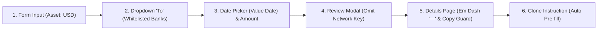
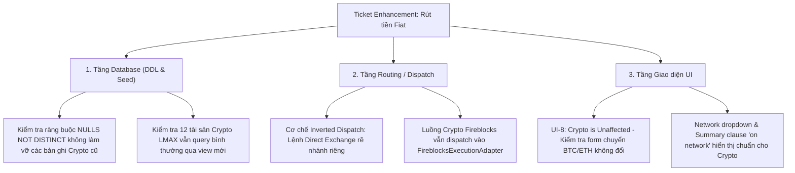

# 📊 [Vsee - Galaxy] Weekly Summary & Demo — Tuần 36 (31.08 - 06.09.2026)

> 📅 **Thời gian cuộc họp:** Thứ Sáu (04/09/2026)  
> 👥 **Attendees:** Brian Pham, Hau Duong (Hầu Dương), Huy Nguyễn, Pháp Huỳnh, Thai Huynh (Quốc Thái)  
> 📁 **Tài liệu tham chiếu:** [Ghi chú ngày 03/09/2026](file:///d:/Workspace/main/Study_GALAXY/DOCUMENT/Ghi%20ch%C3%BA%20daily/Tu%E1%BA%A7n%2036%20%2831.08%20-%2006.09.2026%29/Ghi%20ch%C3%BA%2003092026.md), [Ghi chú ngày 04/09/2026](file:///d:/Workspace/main/Study_GALAXY/DOCUMENT/Ghi%20ch%C3%BA%20daily/Tu%E1%BA%A7n%2036%20%2831.08%20-%2006.09.2026%29/Ghi%20ch%C3%BA%2004092026.md), [Details_Step_BE.md](file:///d:/Workspace/main/Study_GALAXY/DOCUMENT/Details%20Step/Details_Step_BE.md)

---

## 🎯 1. Summary: Tiến độ công việc trong tuần (Work Progress)

### 📌 A. Danh sách ticket đã & đang thực hiện trong tuần 36

| Mã Ticket | Tên công việc | Vai trò / Phạm vi kiểm thử | Trạng thái (Progress) |
| :--- | :--- | :--- | :--- |
| **`QA-6742`** *(GTO-16043)* | **Fiat withdrawal UI + E2E (Transfer Tool)** | - Thực hiện kiểm thử thủ công (Manual Testing) toàn diện giao diện rút tiền Fiat trên Transfer Tool theo ma trận `UI-1` ➔ `UI-9`. - Kiểm thử case **Update ngày (Value date / Update date)** trên form. - Kiểm tra luồng E2E (`E2E-1` ➔ `E2E-4`) từ giao diện người dùng qua Backend. | **Hoàn thành kiểm thử UI & E2E thủ công** (100% test cases UI bao phủ, xác minh xong các UI guards và form input). |
| **`QA-6741`** *(GTO-15979)* | **Fiat withdrawal initiation (Transfer Tool) — Phase 5** | - Nghiên cứu tài liệu kỹ thuật Backend Initiation Layer, phân rã kiến trúc **5 Waves**. - Xây dựng Ma trận kịch bản kiểm thử Backend (**Backend Test Matrix**) qua 7 nhóm: `MIG`, `REG`, `REF`, `CRD`, `STP`, `EXE`, `STA`. - Thiết lập chi tiết từng bước thực thi (**Details Step**) song ngữ kèm SQL query, mock curl và xác minh an toàn tiền tệ (Money Safety). | **Hoàn thành Test Design & Test Scenarios Matrix** (Sẵn sàng cho việc test thực thi tích hợp khi môi trường triển khai xong PR 8425 và BE waves). |

---

### 🖥️ B. Demo các tính năng đã & đang làm (Feature Demo Plan)

#### 1. Demo luồng giao diện rút tiền Fiat (UI Demo - `QA-6742`):
- **Form nhập liệu & Tính hợp lệ của điểm đến (`UI-2`):**
  - Trình diễn chọn tài sản Fiat (`USD`) ➔ Dropdown `To` chỉ hiển thị các tài khoản ngân hàng thụ hưởng đã whitelist (`Whitelisted Bank Beneficiaries`), tuyệt đối không bị lẫn lộn ví/vault Crypto (`no cross-match`).
- **Thao tác case Update ngày (Value Date / Update Date):**
  - Trình diễn chọn và thay đổi trường ngày giao dịch trên giao diện, xác minh layout date picker mượt mà, không bị crash form, dữ liệu cập nhật chuẩn xác sang các màn hình Review và Details.
- **Xác minh hợp đồng dữ liệu & UI Guards (`UI-4`, `UI-5`):**
  - Bật DevTools Network Tab: Chứng minh outbound draft payload lược bỏ hoàn toàn key `blockchainNetworkId` (omitted key).
  - Trình diễn màn hình Review & trang Details hiển thị dấu em dash (`—`) cho trường Blockchain Network.
  - Thao tác click Copy trên các ô có dữ liệu và ô trống: Chứng minh nút Copy hoạt động an toàn, không còn bị văng lỗi console `value.toString()`.
- **Luồng Clone lệnh rút tiền Fiat (`UI-7`):**
  - Nhấn nút Clone từ lệnh đã có: Dữ liệu tài sản, số tiền, tài khoản tự động điền sẵn và draft clone tiếp tục lược bỏ `blockchainNetworkId`.

#### 2. Demo kịch bản kiểm thử Backend & An toàn dữ liệu (`QA-6741`):
- **Demo tính Idempotent trên lệnh tạo (`CRD-2` Case 1):**
  - Gọi API xác nhận lệnh (`create UI`) 2 lần liên tiếp cho cùng 1 `instructionId` ➔ Chứng minh Database chỉ lưu duy nhất 1 bản ghi lệnh, không bị duplicate.
- **Demo từ chối chọn lệch tài sản (`CRD-2` Case 2):**
  - Tạo lệnh rút fiat với Asset là `USD` nhưng chọn tài khoản ngân hàng thụ hưởng loại `EUR` ➔ Hệ thống trả về lỗi `400 Bad Request` ngay lập tức và không ghi dữ liệu rác vào DB.
- **Demo chuỗi trạng thái lệnh rút tiền (`STA-1`):**
  - Theo dõi vòng đời lệnh: `DRAFT` ➔ `PENDING_APPROVAL` (chờ Maker duyệt) ➔ `QUEUED` ➔ `INITIATED` (nhận mã `s_unique_ref` từ sàn) ➔ `SUCCESS` (Poller xác nhận tiền đã về ngân hàng).

---

## 💡 2. Knowledge Sharing: Chia sẻ chuyên môn & Kinh nghiệm thực chiến

### 🌟 Topic 1: [Galaxy Feature: Transfer Tool Instructions] — Kiểm thử chuyên sâu Giao diện (UI) Luồng Lệnh Rút tiền Fiat & Quản lý Thụ hưởng Whitelist

> [!NOTE]
> **📌 Chủ đề lựa chọn (Picked Topic):** **`Transfer Tool Instructions`** (Trọng tâm: **Giao diện Khởi tạo & Kiểm soát Vòng đời Lệnh Rút Fiat** — Ticket `QA-6742`).  
> **Bối cảnh nghiệp vụ:** Nâng cấp hệ thống Transfer Tool từ mô hình chỉ hỗ trợ chuyển tiền Crypto (Networked - gắn với Blockchain Network) sang hỗ trợ thêm Fiat (Network-less - rút tiền pháp định từ Sàn về Tài khoản Ngân hàng thụ hưởng đã Whitelist).

#### 1. Cơ chế lọc động điểm đến thụ hưởng (Destination Eligibility & Whitelisting trên Dropdown `To` - `UI-2`):
- **Phân tách rạch ròi Networked vs Network-less:** Khi người dùng chọn tài sản Fiat (`USD`, `EUR`), dropdown `To` phải tự động lọc và **chỉ hiển thị các tài khoản ngân hàng thụ hưởng đã được phê duyệt trong danh sách trắng (`Whitelisted Bank Beneficiaries`)**, tuyệt đối không lẫn lộn ví hay vault Crypto.
- **Hợp đồng API chặt chẽ (`network = null`):** Các API cung cấp danh mục tiền tệ (`ui/currenciesWithBlockchainNetworks`) và tài khoản (`ui/accountsWithVenue`) bắt buộc phải trả về `network = null` rõ ràng cho Fiat.
  - *Bẫy kỹ thuật (Gotcha):* Nếu Backend vô tình gán một synthetic network ID giả (ví dụ: `networkId = 0` hoặc ID sinh tự động), UI sẽ nhận diện nhầm đây là tài sản Crypto và ẩn sạch toàn bộ tài khoản ngân hàng khỏi dropdown `To`.

#### 2. Xử lý Form nhập liệu, Date Picker & Case Update Ngày (Value Date / Update Date):
- **Kiểm thử Date Picker & Ngày hiệu lực (Value Date):** Thao tác chọn và thay đổi ngày giao dịch trực tiếp trên form. Cần xác minh date picker render mượt mà, hỗ trợ định dạng chuẩn, không gây vỡ layout và không làm crash form khi người dùng liên tục đổi ngày trước khi submit.
- **Fetch số dư khả dụng động (Dynamic Balances - `UI-3`):** Khi chọn tài sản Fiat, danh sách tài khoản nguồn (`From`) tự động truy vấn số dư khả dụng mới nhất và sắp xếp giảm dần. UI phải hiển thị chính xác dòng chú thích `Balance as of <timestamp>` và kích hoạt cảnh báo đỏ `"Amount exceeds the last polled balance"` ngay khi số tiền nhập vượt quá số dư khả dụng.

#### 3. Hợp đồng dữ liệu Null vs Undefined / Omitted Key (`UI-4`):
- **Quy tắc Omitted Key:** Khi người dùng nhấn nút Review để tạo bản nháp lệnh (`instruction/create/draft`), outbound payload gửi lên Backend bắt buộc phải **lược bỏ hoàn toàn (omitted)** key `blockchainNetworkId` (tức thuộc tính này ở trạng thái `undefined` trong JavaScript), **không được gửi `null`, không gửi `0` hay chuỗi rỗng `""`**.
- *Hệ quả nếu vi phạm:* Một số bộ validator nghiêm ngặt của Backend Coordinator sẽ từ chối request với lỗi `400 Bad Request` vì mong đợi kiểu số nguyên hợp lệ thay vì giá trị null.

#### 4. Chiến lược phòng vệ giao diện & Quy chuẩn hiển thị an toàn (UI Defending Strategy - `UI-5`, `UI-7`):
- **Quy chuẩn Placeholder thống nhất:** Đối với các trường dữ liệu không áp dụng cho luồng Fiat (như Blockchain Network, Initiated By, Memo), UI quy chuẩn hiển thị dấu gạch ngang dài **em dash (`—`)** thay vì để khoảng trắng hoặc dùng gạch ngắn thông thường (`-`).
- **Bọc Guard chống văng lỗi Console (Copy Guard):** Một lỗi kinh điển phía Frontend là gọi hàm `value.toString()` khi người dùng nhấn icon Copy tại các ô dữ liệu trống, dẫn đến lỗi `Uncaught TypeError` làm treo các tương tác tiếp theo. QA cần chủ động click thử nút copy ở cả trường có dữ liệu và trường trống để đảm bảo UI an toàn.
- **Tính toàn vẹn khi Clone lệnh (`UI-7`):** Khi nhấn **Clone** từ một instruction rút fiat đã có trong lịch sử, form phải pre-fill chuẩn xác mọi trường (tài sản, tài khoản nguồn/đích, số tiền, loại chuyển tiền) và bản draft clone tiếp tục tuân thủ quy tắc lược bỏ `blockchainNetworkId`.

#### 5. Nhận diện bẫy lỗi ngầm khi kiểm thử (Known Trap - Silent Nested Validation - `UI-9`):
- **Bẫy `FormField` Component:** Component form dùng chung trên hệ thống chỉ có khả năng bắt và hiển thị câu thông báo lỗi trực quan (visual error message) ở các thuộc tính cấp cao nhất (top-level properties).
- **Hành vi khi gặp lỗi trường con lồng sâu (Nested Property):** Nút Submit/Review sẽ bị vô hiệu hóa (disabled) trong im lặng mà **không hiển thị bất kỳ dòng chữ báo lỗi đỏ nào**. QA cần nắm rõ đây là hành vi có sẵn từ trước (pre-existing behavior) của base UI component để tránh tốn thời gian log bug mới không cần thiết, đồng thời hướng dẫn team dev cải tiến hiển thị validation state.

---

### 🤖 Topic 2: Ứng dụng AI trong công việc QA hàng ngày (AI Application for QA)

1. **Trích xuất tài liệu phức tạp từ hình ảnh Confluence/Jira (Vision to Tech Specs):**
   - Sử dụng AI để đọc trực tiếp các hình ảnh chụp màn hình yêu cầu kỹ thuật (PRD, Confluence specs), tự động phân tích và bóc tách các ma trận nghiệp vụ đa tầng (ví dụ: bóc tách toàn bộ 5 Waves và 21 kịch bản kiểm thử của GTO-15979).
2. **Tự động sinh Test Matrix & Details Step có cấu trúc:**
   - Prompting AI chuyển đổi từ yêu cầu tổng quan thành bảng kịch bản kiểm thử chi tiết bao phủ cả Happy Path lẫn Negative/Edge Cases.
   - Chuẩn hóa tài liệu kiểm thử song ngữ: Tự động đặt **Caption tiếng Anh ngắn gọn** (2-4 từ dễ theo dõi trên Jira/TestRail) và sinh nội dung **hướng dẫn thực thi tiếng Việt** kèm các câu lệnh query SQL, payload mẫu `curl`, và mock responses.
3. **Rà soát bẫy an toàn tiền tệ (Money Safety Review):**
   - Nhờ AI rà soát logic bảo vệ tài sản: phát hiện các điểm hở tiềm ẩn nguy cơ rút tiền 2 lần (Double-payment), thiếu cờ chống gửi trùng (Idempotency Key), hoặc trường hợp sàn trả mã HTTP 200 nhưng bên trong body lại là lỗi (như đặc thù API sàn Kraken).

---

### 🛡️ Topic 3: Chiến lược Regression Testing & Khoanh vùng Scope cho Ticket Enhancement

> [!IMPORTANT]
> **Thách thức:** Tính năng rút Fiat (`QA-6741` / `QA-6742`) là một bản **Enhancement** mở rộng trên nền tảng Transfer Tool vốn đang phục vụ chuyển tiền Crypto qua Fireblocks.

#### 🎯 Cách xác định Regression Scope khi kiểm thử Enhancement:

1. **Xác định các điểm chạm dùng chung (Shared Seams):**
   - **Database:** Khi sửa bảng `t_account_supported_asset` để thêm ràng buộc `NULLS NOT DISTINCT` và xóa bảng cũ `t_venue_asset_mapping` thay bằng view, phạm vi hồi quy bắt buộc phải truy vấn lại 12 loại tài sản Crypto của sàn LMAX xem có bị ảnh hưởng không (`MIG-3`).
   - **Service Routing:** Execution Service trước đây mặc định mọi lệnh chuyển tiền đều đi qua Fireblocks. Khi đảo ngược dispatch routing (`EXE-1`), cần hồi quy ngay 1 lệnh chuyển Crypto qua Fireblocks để đảm bảo không bị định tuyến nhầm sang Exchange Adapter.
2. **Nguyên tắc "Crypto is Unaffected" (`UI-8`):**
   - Khi sửa form UI để ẩn trường Network khi chọn Fiat, phải test hồi quy song song với Crypto (BTC, ETH):
     - Trường Blockchain Network vẫn hiển thị và bắt buộc chọn.
     - Câu tóm tắt vẫn giữ nguyên mệnh đề `on <network>`.
     - Request body outbound vẫn gửi kèm `blockchainNetworkId`.
3. **Ngưỡng chặn hồi quy (Regression Gate):**
   - Toàn bộ các test case hồi quy cho Crypto phải đạt trạng thái **Green (Pass 100%)** trước khi ký duyệt nghiệm thu (Sign-off) cho tính năng Fiat mới.

---

## 📋 3. Action Items (Kế hoạch hành động tuần tới)

- [ ] **Tích hợp môi trường & Chạy kiểm thử End-to-End thực tế:**
  - Theo dõi khi PR 8425 (Frontend) và các Waves Backend của `GTO-15979` được merge và deploy lên cùng một môi trường chung.
  - Kích hoạt chạy kịch bản `E2E-1` ➔ `E2E-4` trên môi trường tích hợp thực tế.
- [ ] **Chạy Regression Suite cho luồng Crypto:**
  - Thực thi toàn bộ bộ test hồi quy cho các luồng rút/chuyển tiền mã hóa qua Fireblocks trên Transfer Tool theo đúng phạm vi đã khoanh vùng.
- [ ] **Đồng bộ hóa kịch bản lên TestRail & Jira:**
  - Đưa 9 kịch bản UI (`UI-1` đến `UI-9`) và 21 kịch bản Backend (`MIG`, `REG`, `REF`, `CRD`, `STP`, `EXE`, `STA`) lên TestRail, gắn link mapping vào Jira ticket `QA-6741` và `QA-6742`.
- [ ] **Phối hợp Dev xử lý các phát sinh (nếu có):**
  - Đặc biệt theo dõi sàn Kraken MMAS2 ở Wave 5 liên quan đến mapping mã tiền tệ `ZUSD` và phản hồi lỗi HTTP 200.

---
*Tài liệu tổng hợp phục vụ cuộc họp Weekly Summary & Demo — Tuần 36 (31.08 - 06.09.2026)*
