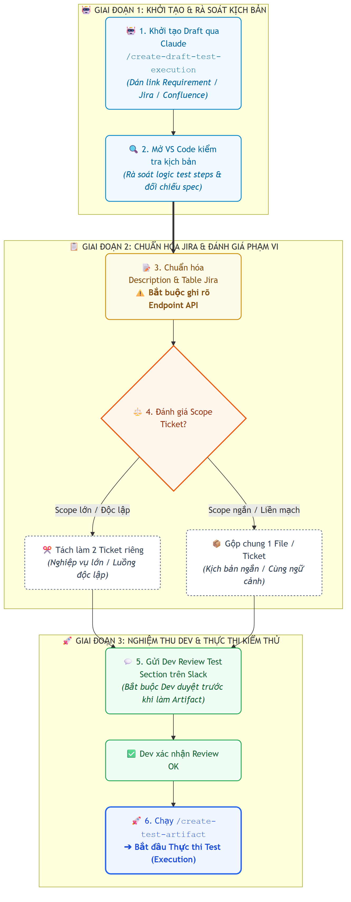
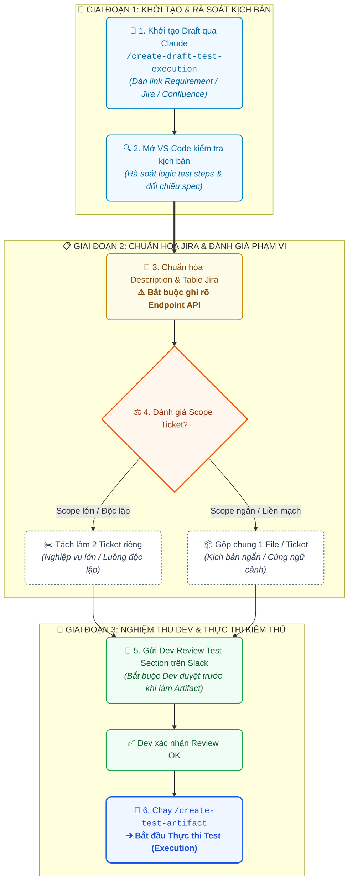

# 🌟 SỔ TAY TỔNG HỢP BÀI HỌC & QUY TRÌNH CHUẨN QA (MASTER QA PLAYBOOK)

> [!NOTE]
> **Mục đích tài liệu:** Tổng hợp toàn diện các bài học kinh nghiệm, kiến thức nền tảng, quy chuẩn kiểm thử và quy trình thực chiến được chắt lọc từ tất cả các ghi chú có gắn sao (`⭐`). Tài liệu đã được **loại bỏ các ticket cụ thể**, **lọc bỏ nội dung trùng lặp**, và **đồng bộ các cập nhật mới nhất** (quy trình AI slash command, quy chuẩn UI/Backend, Money Safety, Jenkins CI/CD và hệ thống Notification).

---

## 📑 MỤC LỤC TỔNG QUAN

1. [🏛️ Phần 1: Kiến thức nền tảng Kiểm thử Phần mềm (QA Fundamentals)](#1-kiến-thức-nền-tảng-kiểm-thử-phần-mềm-qa-fundamentals)
2. [📋 Phần 2: Quy ước Tạo Task & Định dạng Tiêu đề](#2-quy-ước-tạo-task--định-dạng-tiêu-đề)
3. [🌿 Phần 3: Quy chuẩn Git, Quản lý Branch & Code Review](#3-quy-chuẩn-git-quản-lý-branch--code-review)
4. [🤖 Phần 4: Quy trình Ứng dụng AI & Automation Workflow (Cập nhật mới nhất)](#4-quy-trình-ứng-dụng-ai--automation-workflow-cập-nhật-mới-nhất)
5. [🧪 Phần 5: Quy trình Quản lý TestRail & Báo cáo Daily](#5-quy-trình-quản-lý-testrail--báo-cáo-daily)
6. [📢 Phần 6: Quy chuẩn Ma trận Thông báo (Notification Matrix)](#6-quy-chuẩn-ma-trận-thông-báo-notification-matrix)
7. [🏗️ Phần 7: Hệ thống CI/CD Jenkins, Quản lý Secret & Flaky Test](#7-hệ-thống-cicd-jenkins-quản-lý-secret--flaky-test)
8. [🖥️ Phần 8: Bài học Thực chiến Kiểm thử Giao diện (Frontend / UI & E2E)](#8-bài-học-thực-chiến-kiểm-thử-giao-diện-frontend--ui--e2e)
9. [🏛️ Phần 9: Bài học Thực chiến Kiến trúc Backend & An toàn Tiền tệ (Money Safety)](#9-bài-học-thực-chiến-kiến-trúc-backend--an-toàn-tiền-tệ-money-safety)

---

## 1. KIẾN THỨC NỀN TẢNG KIỂM THỬ PHẦN MỀM (QA FUNDAMENTALS)

### 1.1. Phân biệt Error - Defect/Bug - Failure

| Thuật ngữ | Khái niệm cốt lõi | Ví dụ minh họa |
| :--- | :--- | :--- |
| **Error (Sai sót)** | Sai sót do con người (Dev/BA) tạo ra trong quá trình thiết kế, viết code hoặc phân tích requirement. | Dev đặt sai toán tử so sánh, BA ghi nhầm điều kiện phân quyền. |
| **Defect / Bug (Lỗi phần mềm)** | Khiếm khuyết trong phần mềm làm kết quả thực tế (**Actual**) sai lệch so với mong đợi (**Expected**). | Requirement yêu cầu mật khẩu tối thiểu 8 ký tự nhưng hệ thống chỉ cho nhập 6. |
| **Failure (Sự cố vận hành)** | Hệ thống phát sinh hành vi sai lệch hoặc sụp đổ trong môi trường vận hành thực tế khi người dùng thao tác. | Người dùng bấm "Xác nhận chuyển tiền" nhưng hệ thống báo lỗi 500 và đứng yên. |

---

### 1.2. Các cấp độ & Loại hình kiểm thử cốt lõi

* 🟢 **Smoke Test (Kiểm thử khói):**
  - **Mục tiêu:** Kiểm tra nhanh bản build mới có đủ độ ổn định để tiếp tục test hay không.
  - **Câu hỏi cốt lõi:** *"Bản build này có thể test tiếp được không?"*
  - **Hành động:** Chạy các luồng quan trọng nhất (Đăng nhập, tải trang chính, gọi API cơ bản). Nếu Fail ➔ Reject bản build ngay lập tức.
* 🟡 **Sanity Test (Kiểm thử độ lành mạnh):**
  - **Mục tiêu:** Kiểm tra nhanh và sâu vào phân hệ/chức năng vừa được fix bug hoặc sửa đổi code.
  - **Câu hỏi cốt lõi:** *"Tính năng vừa sửa có hoạt động ổn định và hợp lý không?"*
* 🔵 **Retest / Verification Testing (Kiểm tra lại bug):**
  - **Mục tiêu:** Kiểm tra lại chính xác lỗi đã báo trước đó xem Dev đã sửa triệt để chưa.
  - **Câu hỏi cốt lõi:** *"Bug này đã thực sự được fix hết chưa?"*
  - **Quy tắc xử lý:**
    - **Pass:** Đóng bug (*Closed*).
    - **Fail:** Mở lại (*Reopen*) + đính kèm log, ảnh/video bằng chứng, version và điều kiện tái hiện cụ thể.
* 🟣 **Regression Test (Kiểm thử hồi quy):**
  - **Mục tiêu:** Kiểm thử toàn bộ các phân hệ liên quan để đảm bảo việc thêm code mới hoặc sửa lỗi không làm phát sinh lỗi ở các chức năng đang chạy ổn định.
  - **Câu hỏi cốt lõi:** *"Sửa chỗ này có làm hỏng chỗ khác không?"*

---

### 1.3. Phân biệt Verification (Xác minh) và Validation (Xác thực)

> [!TIP]
> **Quy tắc vàng ghi nhớ (Barry Boehm):**
> - **Verification:** *"Are we building the product right?"* (Chúng ta có đang xây dựng sản phẩm đúng cách / đúng thiết kế kỹ thuật không?)
> - **Validation:** *"Are we building the right product?"* (Chúng ta có đang xây dựng đúng sản phẩm mà khách hàng thực sự cần không?)

| Tiêu chí | Verification (Xác minh) | Validation (Xác thực / Thẩm định) |
| :--- | :--- | :--- |
| **Định nghĩa** | Đánh giá phần mềm có tuân thủ đúng đặc tả kỹ thuật, thiết kế và kiến trúc ban đầu hay không. | Đánh giá sản phẩm hoàn thiện có đáp ứng đúng nhu cầu và kỳ vọng thực tế của người dùng cuối hay không. |
| **Bản chất kiểm thử** | **Static Testing (Kiểm thử tĩnh):** Không cần thực thi hoặc chạy mã nguồn. | **Dynamic Testing (Kiểm thử động):** Bắt buộc phải chạy ứng dụng/mã nguồn để quan sát hành vi thực tế. |
| **Hoạt động chính** | Review tài liệu, Walkthroughs, Inspections, Code Review, Static Analysis. | Functional Testing, System Testing, API/UI Testing, UAT (User Acceptance Testing). |
| **Đối tượng kiểm tra** | SRS, tài liệu kiến trúc, Database schema, mã nguồn (Code). | Ứng dụng/bản build thực tế đang vận hành trên môi trường test/staging/production. |
| **Thời điểm thực hiện** | Diễn ra sớm ngay từ khâu phân tích yêu cầu, thiết kế và viết code. | Diễn ra sau khi đã có bản build phần mềm chạy được. |
| **Mục tiêu cốt lõi** | Ngăn ngừa lỗi phát sinh từ sớm (**Bug Prevention**). | Phát hiện và xử lý lỗi khi phần mềm đang chạy (**Bug Detection**). |

---

### 1.4. Chu trình kiểm thử chuẩn (Standard Testing Lifecycle)

> 🚀 **Deploy Build mới** ➔ **Smoke Test** ➔ *(Nếu Passed)* ➔ **Sanity / Functional Test** ➔ **Retest Bug** ➔ **Regression Test** ➔ **Release**.

---

## 2. QUY ƯỚC TẠO TASK & ĐỊNH DẠNG TIÊU ĐỀ

Khi tạo task hoặc khởi tạo branch, luôn chủ động tuân thủ cấu trúc tiền tố chuẩn để đồng bộ hệ sinh thái Jira, Confluence và CI/CD:

| Phân loại công việc | Định dạng tiêu đề chuẩn | Mục đích áp dụng |
| :--- | :--- | :--- |
| **Kiểm thử thực thi / Giao diện** | `[TEST EXECUTION] - [ID_TICKET] TITLE` | Dành cho các task chạy test thủ công, test UI/E2E, tạo test artifact. |
| **Kiểm thử tự động API** | `[API-QA] - [ID_TICKET] TITLE` | Dành cho việc viết kịch bản và test code tự động hóa endpoint API. |
| **Kiểm thử giao diện Frontend** | `[UI-QA] - [ID_TICKET] TITLE` | Dành cho việc review, kiểm thử form, validation và UI component. |

### Vòng đời trạng thái Ticket trên Jira:
```
Designing (Thiết kế test cases) 
  ➔ Testing / In Project (Thực thi test / Code automation) 
  ➔ Under Review (Đã mở PR, chờ Reviewer duyệt) 
  ➔ Pass Test (Nghiệm thu thành công ✅) 
  ➔ Closed
```

---

## 3. QUY CHUẨN GIT, QUẢN LÝ BRANCH & CODE REVIEW

### 3.1. Chuỗi lệnh Git chuẩn khi tạo nhánh mới

Luôn kéo code mới nhất từ nhánh `main` trước khi rẽ nhánh:

```bash
# 1. Fetch thông tin mới nhất từ remote
git fetch origin

# 2. Chuyển sang nhánh main và cập nhật
git switch main
git pull origin main

# 3. Tạo và chuyển sang nhánh mới tương ứng với endpoint/ticket
git checkout -b <branch-name>-<endpoint>
# hoặc: git switch -c <branch-name>-<endpoint>

# 4. Đẩy nhánh mới lên remote lần đầu
git push -u origin <branch-name>-<endpoint>
```

> [!IMPORTANT]
> **Quy tắc 1 Branch - 1 Endpoint:** Mỗi branch chỉ tập trung làm việc cho **MỘT endpoint duy nhất** để cô lập thay đổi, tránh xung đột code (conflict) và giúp reviewer dễ dàng phê duyệt.

---

### 3.2. Quy trình Review Code nội bộ (`/review-code`)

Trước khi tạo Pull Request, bắt buộc tự rà soát mã nguồn:
1. **Chạy lệnh `/review-code`:** AI tự động quét lỗi logic, assertions và cấu trúc file `pytest.ini`.
2. **Dọn dẹp Orphan Functions:** Quét và loại bỏ các hàm mồ côi (không còn được gọi trong test suite).
3. **Kiểm tra Schema Pydantic:** Đối chiếu các models dữ liệu đảm bảo khớp 100% với response API thực tế.
4. **Chạy Test Suite cục bộ:** Đảm bảo toàn bộ test case Pass 100% trước khi push code lên remote.

---

### 3.3. Mở Pull Request (PR) & Xử lý phản hồi Review

* **Tạo PR Summary:** Chạy lệnh `/pr summary` để AI tự động trích xuất nội dung thay đổi.
* **Quy chuẩn thông tin PR trên GitHub:**
  - **Mô tả (Description):** Dán toàn bộ nội dung PR Summary.
  - **Bằng chứng (Evidence):** Đính kèm ảnh chụp màn hình kết quả chạy test Pass 100%.
  - **Gán Reviewers:** Chọn reviewer phụ trách (ví dụ: Mohit, Dastan, Sandeep).
  - **Cập nhật Jira:** Dán link PR vào Jira ticket và chuyển trạng thái sang **`Under Review`**.
* **Xử lý phản hồi (`/resolve-pr`):**
  - Đọc kỹ feedback của Reviewer ➔ Sửa code ➔ Commit và Push lên branch.
  - Chạy `/resolve-pr` (hoặc Resolve Conversation) để đóng các luồng comment đã giải quyết xong.

---

## 4. QUY TRÌNH ỨNG DỤNG AI & AUTOMATION WORKFLOW (CẬP NHẬT MỚI NHẤT)

> [!NOTE]
> **Cập nhật mới:** Hiện tại đã có các slash commands chuyên dụng **`/create-draft-test-execution`** và **`/create-test-artifact`**, thay thế cho quy trình copy prompt thủ công trước đây.

### 4.1. Sơ đồ Quy trình Chuẩn 6 Bước (Draft Test Case ➔ Test Artifact ➔ Execution)

<p align="center">
  
</p>

<details>
<summary><b>🔍 Nhấn vào đây để xem / sao chép mã nguồn Mermaid của sơ đồ</b></summary>



</details>

#### 📊 Bảng tổng hợp chi tiết từng bước thực thi:

| Giai đoạn | Bước | Thao tác chính | Công cụ / Lệnh | Yêu cầu chất lượng & Lưu ý cốt lõi |
| :---: | :---: | :--- | :--- | :--- |
| **Giai đoạn 1** | **1** | **Khởi tạo Draft** | Claude + `/create-draft-test-execution` | Dán link tài liệu yêu cầu (Jira/Confluence/PR); AI tự phân tích và sinh kịch bản. |
| *(Khởi tạo)* | **2** | **Self-Review** | Visual Studio Code | Mở file `.md` vừa sinh, đọc kỹ từng test step, đối chiếu logic nghiệp vụ. |
| **Giai đoạn 2** | **3** | **Chuẩn hóa Jira** | Prompt đối chiếu ticket mẫu | **Bắt buộc ghi rõ Endpoint** (`URL`, `Method`, `Payload`) để Dev hiểu rõ API call. |
| *(Chuẩn hóa)* | **4** | **Phân tách Scope** | Đánh giá độ phức tạp | Tách 2 ticket riêng nếu luồng độc lập/dài; gộp 1 file nếu ngắn gọn. |
| **Giai đoạn 3** | **5** | **Gửi Dev Review** | Kênh Slack (`@dev_name`) | Nhắn Dev phụ trách review; **tuyệt đối không tự ý làm Artifact khi chưa duyệt**. |
| *(Nghiệm thu)* | **6** | **Tạo Artifact & Test** | `/create-test-artifact` | Sau khi Dev duyệt OK, sinh test artifact chuẩn và tiến hành chạy test. |

1. **Khởi tạo Draft Test Case qua AI (Claude):**
   - Lấy link tài liệu yêu cầu nghiệp vụ (**Requirement / Confluence spec / Jira ticket**).
   - Dán link vào Claude và thực thi slash command:
     ```bash
     /create-draft-test-execution
     ```
2. **Kiểm tra & Rà soát trên VS Code:**
   - Mở file markdown vừa sinh trong **Visual Studio Code (VS Code)**.
   - Đọc kỹ, kiểm tra tính logic và đối chiếu với spec.
3. **Chuẩn hóa bảng mô tả để dán vào Jira:**
   - Sử dụng prompt chuẩn để AI đối chiếu với format ticket QA mẫu:
     ```text
     Please check with the existing ticket QA I sent you before and create the table and description that matches its format please.
     ```
   - > [!IMPORTANT]
     > **Lưu ý bắt buộc về Endpoint:** Khi mô tả API call, **bắt buộc phải ghi rõ Endpoint** (`URL`, `Method`, `Payload`) — cần xác định chính xác đang gọi vào endpoint nào và cơ chế thực thi ra sao.
4. **Xác định cấu trúc Ticket (Tách hay Gộp):**
   - **Tách làm 2 ticket riêng:** Nếu các nghiệp vụ riêng lẻ, phạm vi lớn hoặc luồng xử lý độc lập.
   - **Gộp chung 1 file/ticket:** Nếu kịch bản ngắn, liền mạch và cùng ngữ cảnh tính năng.
5. **Gửi Dev Review trước khi làm Test Artifact:**
   - Sau khi cập nhật Test Section lên Jira, **bắt buộc đưa cho Dev review và chốt trước**.
   - > [!WARNING]
     > **Tuyệt đối không tự ý làm Test Artifact khi Dev chưa review và đồng thuận với Test Section.**
   - Mẫu tin nhắn gửi trên kênh Slack:
     > 💬 *"Hi @<dev_name>, I have added the test section here: `<link_ticket_jira>`. Please help reviewing. Thank you!"*
6. **Tạo Test Artifact & Tiến hành thực thi:**
   - Khi Dev đã review và xác nhận **OK** ➔ Chạy tiếp slash command:
     ```bash
     /create-test-artifact
     ```
   - Sau khi hoàn tất Test Artifact, bắt đầu tiến hành thực thi kiểm thử (**Execute Tests**).

---

### 4.2. Mẫu Prompt cấu hình Setup & Teardown cho Helper (Triệt tiêu Flaky Test)

Dùng để cấu hình file helper tự động reset trạng thái approval, tránh lỗi kiểm thử không ổn định (flaky) trên Jenkins:

```markdown
Please take a look at this `<link_path_helpers>`.

I want to implement a test setup and teardown flow for user group settings:
1. **Setup:**
   - Get the current configuration of the `TEST_AUTOMATION` user group and remember/cache its initial state.
   - Update the `TEST_AUTOMATION` user group setting so that it does not require `pending_approval` (always).

2. **Teardown:**
   - Set the `TEST_AUTOMATION` user group back to its previous state recorded during setup.
```

---

## 5. QUY TRÌNH QUẢN LÝ TESTRAIL & BÁO CÁO DAILY

### 5.1. Cấu hình hệ thống TestRail chuẩn

* **Project ID mặc định:** `30`
* **Cấu hình Suite ID theo phân hệ:**
  - `Suite ID API`: **945**
  - `Suite ID UI`: **946**
  - `Suite ID E2E`: **947**

### 5.2. Phân biệt các lệnh TestRail

* **`/create-testrail`:** Chỉ thực hiện tạo test case trên TestRail, **không** tác động hay cập nhật gì lên Jira ticket.
* **`/sync-testrail`:** **Đồng bộ và cập nhật (update)** ID test cases và kết quả trực tiếp lên Jira ticket.
* *Khi xử lý file lớn:* Tránh dùng file local chưa đồng bộ để tránh lệch dữ liệu với live.

### 5.3. Quy chuẩn Báo cáo Daily Report cuối ngày (`/daily-report`)

* Chạy lệnh `/daily-report` vào cuối ngày (khuyến nghị lúc 17:35).
* Định dạng chuẩn tiếng Anh gồm 4 mục:
  1. **What I’ve done:** Liệt kê các đầu việc đã hoàn thành trong ngày (kèm kết quả pass/fail).
  2. **In Progress:** Các công việc đang thực hiện dở dang và tiến độ hiện tại.
  3. **Todo:** Kế hoạch các đầu việc cho ngày làm việc tiếp theo.
  4. **Issues:** Khó khăn, vướng mắc, blocker (nếu không có thì ghi `None`).
* *Quy tắc ghi chú khi không cập nhật repo:* Nếu ngày hôm đó không có thay đổi mã nguồn, ghi chú: `"None cause not update anything on repos"`.

---

## 6. QUY CHUẨN MA TRẬN THÔNG BÁO (NOTIFICATION MATRIX)

Hệ thống phân chia rạch ròi cơ chế gửi thông báo qua **Email** và **Slack** dựa trên mức độ quan trọng và tác động tài chính của từng trạng thái lệnh (Instruction Status):

> [!IMPORTANT]
> - **📧 Email Notification (3 trạng thái chọn lọc):** Chỉ gửi cho các mốc nghiệp vụ trọng yếu cần con người hành động hoặc ảnh hưởng trực tiếp đến dòng tiền (`Approval Required`, `Approved`, `Failed`).
> - **💬 Slack Notification (TẤT CẢ 7 trạng thái):** Gửi thông báo toàn diện theo dõi liên tục toàn bộ vòng đời của lệnh.

### 📊 Bảng đối chiếu cơ chế thông báo (Email vs Slack Notification Matrix)

| STT | Trạng thái lệnh (Instruction Status) | 📧 Email Notification | 💬 Slack Notification | Ý nghĩa & Hành động kích hoạt |
| :---: | :--- | :---: | :---: | :--- |
| 1 | **Pending / Approval Required** | ✅ **GỬI** | ✅ **GỬI** | Lệnh vừa tạo, cần Checker vào kiểm tra và duyệt |
| 2 | **Initiated (Init)** | ❌ Không gửi | ✅ **GỬI** | Lệnh đã duyệt xong, bắt đầu thực thi các bước chuyển tiền |
| 3 | **Approved** | ✅ **GỬI** | ✅ **GỬI** | Lệnh đã được Checker phê duyệt thành công |
| 4 | **Success** | ❌ Không gửi | ✅ **GỬI** | Toàn bộ các bước chuyển tiền hoàn tất thành công 100% |
| 5 | **Failed (Failed Instruction)** | ✅ **GỬI** | ✅ **GỬI** | Lệnh bị lỗi ở ít nhất 1 step (cảnh báo khẩn cấp) |
| 6 | **Abort** | ❌ Không gửi | ✅ **GỬI** | Lệnh đang chạy bị chủ động ngắt / dừng lại |
| 7 | **Reject** | ❌ Không gửi | ✅ **GỬI** | Lệnh bị Checker từ chối phê duyệt |

---

## 7. HỆ THỐNG CI/CD JENKINS, QUẢN LÝ SECRET & FLAKY TEST

### 7.1. Bản chất & Vai trò của Jenkins

Jenkins là một **hệ thống CI/CD (Continuous Integration / Continuous Delivery)** hoàn chỉnh, không chỉ dùng riêng cho việc chạy test tự động:
1. **Run automated tests:** Tự động thực thi API, UI, Regression, Integration tests.
2. **Build applications:** Biên dịch mã nguồn, đóng gói ứng dụng.
3. **Deploy to servers:** Tự động triển khai lên Dev, Staging, Production.
4. **Run scheduled jobs:** Thiết lập lịch trình chạy batch jobs, data reconciliation.
5. **DevOps Integrations:** Tích hợp với GitHub, Docker, Kubernetes.

---

### 7.2. Quy trình Thêm Secret mới cho Jenkins (Add New Secret)

#### 📋 1. Ma trận triển khai & Phân quyền duyệt

| Repository | Thứ tự thực hiện | Nhóm xét duyệt (Approval) | Kênh phối hợp / Ghi chú |
| :--- | :---: | :--- | :--- |
| **`terraform`** | **1 (Làm trước)** | **SRE-ONCALL** (Infra Team) | Kênh Slack `#production_assistance` |
| **`jenkins`** | **2 (Làm sau)** | **Team QA** | Phê duyệt nội bộ team QA |

#### 🚀 2. Các bước triển khai & Merge PR:
1. **Khai báo trên repo `terraform`:** Tạo Pull Request khai báo secret.
2. **Xin Approval:** Liên hệ SRE-ONCALL trên kênh Slack `#production_assistance`.
3. **Thực thi lệnh Atlantis:** Sau khi có approval, gõ comment trên PR:
   ```bash
   atlantis apply
   ```
4. **Kiểm tra & Merge:** Chỉ merge PR sau khi `atlantis apply` đã chạy thành công 100%.

> [!WARNING]
> **Quy tắc đặt tên Key trên `terraform`:** Bắt buộc phải **thêm dấu sao (`*`) vào sau cùng của key** (suffix `*`, ví dụ: `<secret_key_name>*`) để hệ thống match và cấp quyền đúng phạm vi.

---

### 7.3. Xử lý Multi-file Results trong Re-run trên Jenkins

Khi Jenkins kích hoạt chế độ **Re-run** cho các test case thất bại:
- Hệ thống sẽ sinh ra **nhiều file kết quả (multi-file results)** tương ứng với từng lượt chạy.
- Script xử lý thông báo bắt buộc phải đọc, gom và tổng hợp toàn diện dữ liệu từ tất cả các file kết quả để thông báo gửi về kênh Slack phản ánh chính xác kết quả cuối cùng (tránh việc kết quả lượt chạy sau ghi đè hoặc làm mất thông tin lượt chạy trước).

---

## 8. BÀI HỌC THỰC CHIẾN KIỂM THỬ GIAO DIỆN (FRONTEND / UI & E2E)

### 8.1. Quy tắc UI Guards & Clean Browser Console

* **Bẫy crash `value.toString()` khi Copy ô trống:**
  - Trên các trang chi tiết, nếu một trường dữ liệu không có giá trị (`null` hoặc `undefined`), click vào icon copy có thể gây vỡ ứng dụng do gọi `toString()` trên đối tượng rỗng.
  - **Bài học:** Bắt buộc bọc bảo vệ (Guard Check). Với các trường trống hoặc không áp dụng, luôn hiển thị dấu **em dash (`—`)** và ẩn icon copy.
* **Quy chuẩn hiển thị:** Luôn dùng dấu gạch ngang dài em dash (`—`) thay vì gạch ngắn (`-`) hoặc để khoảng trắng lỗi.

---

### 8.2. Phân tách rạch ròi giữa Fiat (Network-less) và Crypto (Networked)

* **Tài sản Fiat:** Không gắn liền với mạng blockchain (`network = null`).
  - Dropdown chọn mạng blockchain phải được ẩn hoặc vô hiệu hóa, giữ lại placeholder hiển thị thích hợp.
  - Payload gửi lên backend (Outbound Draft Request) phải **lược bỏ hoàn toàn key `blockchainNetworkId`** (omitted hoàn toàn, không gửi `null`, không gửi `0`, không gửi `""`).
* **Dropdown đích đến (`To`):**
  - Khi chọn Fiat: Chỉ hiển thị danh sách tài khoản ngân hàng thụ hưởng đã được Whitelist. Tuyệt đối không được lẫn lộn ví/vault crypto.
  - Khi chọn Crypto: Chỉ hiển thị danh sách ví/vault blockchain. Tuyệt đối không hiển thị tài khoản ngân hàng.

---

### 8.3. Các bẫy kiểm thử giao diện cần lưu ý

1. **Bẫy lỗi validation lồng sâu (Nested Field Validation Trap):**
   - Một số component form chỉ hiển thị thông báo lỗi trực quan cho các trường dữ liệu cấp cao nhất (top-level).
   - Nếu lỗi xảy ra ở một trường con lồng sâu (nested object), nút submit có thể bị vô hiệu hóa mà màn hình không hiển thị câu thông báo lỗi cụ thể nào. Đây là hành vi do thiết kế component cũ, cần nắm rõ để phân biệt giữa lỗi hệ thống và lỗi validation.
2. **Kiểm tra trường ngày tháng (Value Date / Update Date):**
   - Đổi ngày trên form phải tự động tính toán lại thời gian xử lý dự kiến.
   - Thao tác date picker không được làm crash form hoặc vỡ layout giao diện.
3. **Xử lý các nhánh Hủy lệnh (Abort) và Từ chối (Reject):**
   - Checker từ chối duyệt ➔ Lệnh chuyển ngay sang `REJECTED`.
   - Bấm Abort khi lệnh đang ở hàng đợi (`QUEUED`) ➔ Lệnh chuyển `ABORTED`.
   - Cố tình Abort khi lệnh đã bắt đầu thực thi (`INITIATED`) ➔ Hệ thống phải chặn lại và hiển thị cảnh báo rõ ràng trên UI (không cho phép hủy ngầm).

---

## 9. BÀI HỌC THỰC CHIẾN KIẾN TRÚC BACKEND & AN TOÀN TIỀN TỆ (MONEY SAFETY)

### 9.1. Kiến trúc phân rã 5 Waves trong Backend Execution

Khi kiểm thử các hệ thống chuyển tiền backend phức tạp, phân rã phạm vi kiểm thử theo 5 Waves kiến trúc:

```
Wave 1: Migration & Seed (DDL, schema, ràng buộc NULLS NOT DISTINCT, account classes)
  ➔ Wave 2: Registry & Reference Service (Adapter sync whitelist, map fiatDestination)
  ➔ Wave 3: Coordinator & Step Handler (Validation, chặn machine channel, step routing)
  ➔ Wave 4: Execution Service (Inverted dispatch routing, map payload theo từng sàn đối tác)
  ➔ Wave 5: Lifecycle & Venue E2E (Kiểm thử vòng đời giao dịch thực tế kết nối trực tiếp các sàn)
```

---

### 9.2. 5 Nguyên tắc Vàng về An toàn Tiền tệ (Money Safety Principles)

```markdown
  ╔═══════════════════════════════════════════════════════════════════════╗
  ║                 5 NGUYÊN TẮC VÀNG VỀ AN TOÀN TIỀN TỆ                  ║
  ╠═══════════════════════════════════════════════════════════════════════╣
  ║ 1. Chặn kênh tự động (Machine-channel Refusal)                        ║
  ║ 2. Cơ chế Fail-Closed Lookups (Không dùng Fallback mặc định)          ║
  ║ 3. Đảm bảo tính Idempotency & Chống Double-Payment                    ║
  ║ 4. Mapping mã tiền tệ sàn chính xác (Venue Symbol Mapping)            ║
  ║ 5. Xử lý bẫy sàn trả về HTTP 200 kèm nội dung báo lỗi (Error Body)   ║
  ╚═══════════════════════════════════════════════════════════════════════╝
```

1. **Chặn kênh tự động (Machine-channel Refusal):**
   - Các lệnh rút tiền pháp định hoặc chuyển tài sản thật ra ngoài hệ thống bắt buộc phải có sự can thiệp và phê duyệt của con người (**Human-in-the-loop / Maker-Checker** qua UI).
   - Mọi nỗ lực gọi tự động qua Machine API hoặc Service-to-Service bot phải bị chặn cứng (`Refused`) ngay tại tầng Coordinator.
2. **Cơ chế Fail-Closed Lookups:**
   - Trong quá trình phân giải thông tin ngân hàng thụ hưởng hoặc tài khoản đích, nếu dữ liệu bị thiếu hoặc không khớp 100%, hệ thống phải dừng xử lý ngay lập tức (`Fail-closed`). Tuyệt đối không sử dụng giá trị mặc định (fallback default) để đoán dữ liệu.
3. **Tính Idempotency & Chống Double-Payment:**
   - Kiểm soát chặt chẽ khóa chống trùng lặp (`Idempotency Key`) ở cả phía điều phối (Coordinator) lẫn khi phát lệnh sang sàn đối tác.
   - Gửi trùng request hoặc trigger lặp webhook không bao giờ được phép sinh ra 2 giao dịch chuyển tiền.
4. **Mapping mã tiền tệ sàn chính xác (Venue Symbol Mapping):**
   - Nhiều sàn giao dịch sử dụng mã tiền tệ nội bộ đặc thù (ví dụ: sàn Kraken dùng `ZUSD` thay vì `USD`). Service phải chuyển đổi chính xác giữa mã chuẩn quốc tế và mã riêng của venue trước khi dispatch.
5. **Xử lý bẫy sàn trả về HTTP 200 kèm error message trong body:**
   - Một số sàn đối tác trả về HTTP status code là `200 OK` nhưng cấu trúc JSON bên trong lại chứa thông báo lỗi nghiệp vụ (`"error": [...]` hoặc `"status": "REJECTED"`).
   - Test script và service bắt buộc phải kiểm tra sâu vào body response; nếu có lỗi phải cập nhật trạng thái lệnh sang **`FAILED`**, tuyệt đối không được dựa vào mỗi HTTP status 200 để đánh dấu thành công.

---

> [!TIP]
> 📌 *File tổng hợp này được duy trì liên tục làm cẩm nang chuẩn cho đội ngũ QA. Mọi quy trình hoặc bài học kinh nghiệm mới sẽ được cập nhật trực tiếp vào tài liệu này.*
